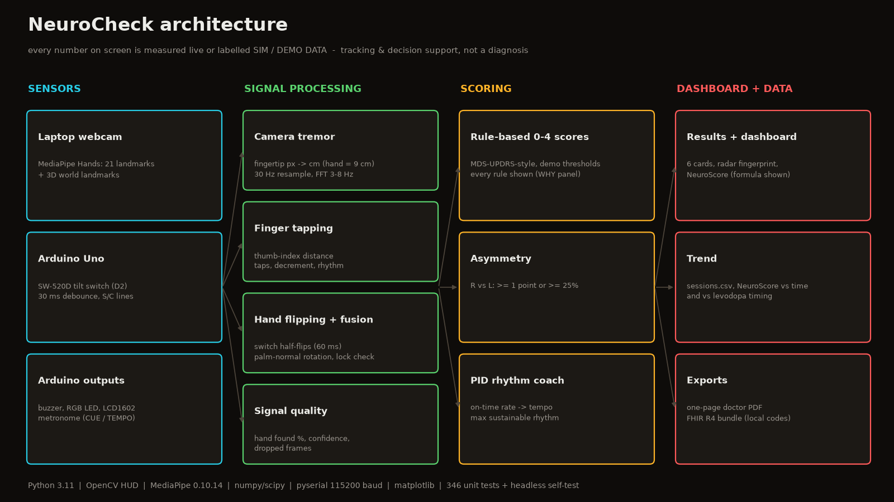
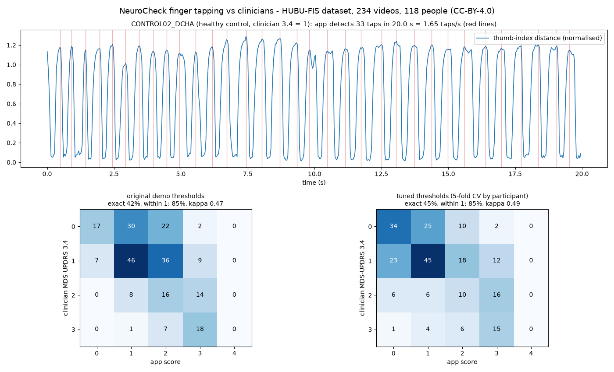

# NeuroCheck — Parkinson's Motor Check Station

A tabletop check-up with three tests per hand, each scored 0–4 with every rule shown:
**rest tremor** (webcam), **finger tapping** (webcam) and **rapid hand flipping** (SW-520D tilt
switch + webcam fusion), plus a **PID rhythm coach**, a results dashboard with a transparent
**NeuroScore**, a trend view, and **PDF / FHIR** exports.

> **Tracking and decision-support tool, NOT a diagnosis. All thresholds are demo thresholds.**
> Every number on screen is measured live or labelled **SIM** / **DEMO DATA**.



## 1. Install (Windows, one time)
MediaPipe 0.10.14 needs Python 3.11 (3.13/3.14 have no wheels).
```powershell
uv venv --python 3.11 .venv                       # add --native-tls behind Cloudflare WARP / proxies
uv pip install --python .venv\Scripts\python.exe -r requirements.txt
```
Arduino tooling (portable, no admin needed):
```powershell
# put arduino-cli.exe on PATH (https://github.com/arduino/arduino-cli/releases), then:
arduino-cli core update-index
arduino-cli core install arduino:avr
arduino-cli lib install "LiquidCrystal" "LiquidCrystal I2C"
```
Always run Python as `.venv\Scripts\python` (plain `python` may be a different version).

## 2. Wire (UNPLUG USB FIRST)
| Part | Part pin | Arduino Uno |
|---|---|---|
| SW-520D bare 2-leg switch | leg 1 / leg 2 | D2 / GND (internal pull-up) |
| SW-520D 3-pin module | VCC / GND / DO | 5V / GND / D2 |
| Buzzer | + (long leg / red) / − | D6 / GND |
| Green LED | long leg via 220 Ω / short leg | D9 / GND |
| Yellow LED | long leg via 220 Ω / short leg | D10 / GND |
| Red LED | long leg via 220 Ω / short leg | D11 / GND |
| LCD1602 I2C *(optional)* | VCC / GND / SDA / SCL | 5V / GND / A4 / A5 |
| LCD1602 parallel *(optional)* | RS / E / D4 / D5 / D6 / D7 | D12 / D8 / D7 / D5 / D4 / D3 |
| LCD1602 parallel | VSS / VDD / RW / K | GND / 5V / GND / GND |
| LCD1602 parallel | A (backlight +) | 5V via 220 Ω |
| LCD1602 parallel | V0 (contrast) | middle of a 10 kΩ pot (outer pins 5V / GND) |

The onboard LED (D13) mirrors the tilt switch, so you can check the sensor without the app.
On power-up the LEDs light green → yellow → red once: if the order is wrong, swap the three
`PIN_LED_*` numbers at the top of the sketch. `tools/check_pins.py` proves there are no pin conflicts.
During hand flipping the LEDs show your live flip speed (green fast, yellow medium, red slow);
after the session they show the overall result.

## 3. Configure + upload firmware
Edit the three `#define`s at the top of `firmware/neurocheck/neurocheck.ino`:
`SWITCH_MODULE` (0 bare switch / 1 3-pin module), `BUZZER_PASSIVE` (0 active: sticker, sealed
bottom / 1 passive: green board visible), `LCD_MODE` (`LCD_NONE` / `LCD_I2C` / `LCD_PARALLEL`).
Everything works with no LCD.
```powershell
arduino-cli board list                                   # find the COM port
arduino-cli compile --fqbn arduino:avr:uno firmware\neurocheck
arduino-cli upload  --fqbn arduino:avr:uno -p COM5 firmware\neurocheck
bash firmware/compile_all.sh                             # all 12 #define combinations + pin check
```
Close the app (or any serial monitor) before uploading — only one program can own the port.

## 4. Run
```powershell
.venv\Scripts\python app.py                    # real Arduino (auto-detect) + webcam
.venv\Scripts\python app.py --port COM5        # force a port
.venv\Scripts\python app.py --sim              # no hardware: fake switch + fake hand (all labelled SIM)
.venv\Scripts\python app.py --sim-device       # fake switch + real webcam
.venv\Scripts\python app.py --seed-history     # add 14 days x 2 sessions of DEMO DATA first
.venv\Scripts\python app.py --no-boot          # skip the boot self-check
.venv\Scripts\python -m pytest                 # unit + app tests
.venv\Scripts\python selftest.py --screens screenshots   # headless full session, PASS/FAIL table
.venv\Scripts\python tools/gui_smoke.py        # scripted real-window run, screenshots
.venv\Scripts\python tools/tune_pid.py         # re-tune the coach on the simulated patient
```
**Keys:** SPACE next · **R** restart (any screen) · **Q/ESC** quit · **H** trend ·
**C** rhythm coach (welcome/results; **L** switches hand) · **P** doctor PDF · **F** FHIR JSON
(results/dashboard) · on Welcome type the hours since the last levodopa dose (**N** = unknown).
Sim only: **T** toggle fake tremor, **F** fake stuck sensor (during tests).

Exports land in `exports/` next to `sessions.csv`.

## 4b. Record raw data and calibrate (more accuracy for YOUR setup)
```powershell
.venv\Scripts\python app.py --record --label alex_normal         # healthy volunteer, normal effort
.venv\Scripts\python app.py --record --label alex_acted_tremor   # same person acting a symptom
.venv\Scripts\python tools\calibrate.py                          # report + suggested thresholds
```
Do 2-3 normal runs per person with 3-5 people, plus a few acted runs (5 Hz shake, slow or small
taps, slow/small flips). The report shows false alarms (normal runs scoring > 0), misses (acted
runs scoring 0) and suggested thresholds. This tunes the app to your camera, lighting and sensor;
it is not clinical validation (that needs patients scored by a neurologist).

## 5. Screens
1. **Boot self-check** — camera + FPS, MediaPipe load time, Arduino port, READY, STATE round
   trip, tilt reading, buzzer + LED test (SIM in simulation).
2. **Welcome** — protocol + dose question.
3. **Tests** (6) — Ready → 3-2-1 → 10 s recording → WHY THIS SCORE panel (every rule, measured
   value vs threshold). Live: glowing landmarks, scan line, live signal, SIGNAL QUALITY meter;
   flipping adds PALM UP/DOWN, tilt trace, flip timeline and the camera rotation gauge with
   FUSION LOCKED / MISMATCH.
4. **Results** — 6 cards with all reasons, LOW CONFIDENCE badges, asymmetry line; LED colour
   (green 0–1, yellow 2, red 3–4) and LCD summary.
5. **Dashboard** — Motor Fingerprint radar (R/L), NeuroScore with its formula.
6. **Trend** — NeuroScore over time, NeuroScore vs hours since dose, per-hand sub-scores
   (seeded points hollow, labelled DEMO DATA).
7. **Rhythm coach** (C) — 10 s uncued, 35 s metronome with a PID adapting the tempo to an 85 %
   on-time target; result: max sustainable rhythm, asynchrony, cued vs uncued rate.

## 6. Scoring (demo thresholds; constants at the top of `scoring.py`)
- **Tremor** (3.17 style): fingertip in cm (hand wrist→middle-MCP = 9 cm), 30 Hz, 1 Hz high-pass,
  FFT x+y, clear peak 3–8 Hz (≥ 3× median, local max), band-limited amplitude.
  0: < 0.1 cm / no peak · 1: < 1 · 2: 1–3 · 3: 3–10 · 4: ≥ 10 cm.
- **Finger tapping** (3.4 style): slow < 1.5 taps/s, small < 0.8, decrement > 30 %, CV > 0.5,
  any hesitation → score = problems (max 3); < 5 taps → 4. Thresholds tuned on a public
  clinician-rated dataset — see *Validation on real patients* below.
- **Hand flipping** (3.6 style): slow < 1.5 full flips/s, CV > 0.35, slowdown > 25 %, any
  hesitation, small rotation < 120°, rotation shrink > 25 % → problems (max 3); < 5 flips → 4.
- **Asymmetry**: ≥ 1 point, or ≥ 25 % on taps/s, flips/s or tremor cm.
- **NeuroScore** = 100 × (1 − Σ scores / (4 × scored tests)). Composite tracking index.

## 6b. Validation on real patients (finger tapping)
Public **HUBU-FIS** dataset (University of Burgos; Zenodo 10.5281/zenodo.17738775, CC-BY-4.0):
234 phone videos, 118 people (controls + Parkinson's), each hand rated by clinicians on
MDS-UPDRS 3.4. The app's own MediaPipe settings and tapping maths were run on every video:

| Thresholds | exact match | within 1 point | weighted kappa |
|---|---|---|---|
| original demo thresholds | 42 % | 85 % | 0.47 |
| tuned, 5-fold cross-validated by participant (honest) | 45 % | 85 % | 0.49 |



Reproduce (10.8 GB download, ~25 min MediaPipe pass):
```powershell
.venv\Scripts\python toolsetch_parallel.py "https://zenodo.org/api/records/17738775/files/HUBU-FIS_FT.zip/content" datasets\hubu\HUBU-FIS_FT.zip
# unzip to datasets\hubu\extracted, build datasets\hubu\labels.csv (video,participant,rating)
.venv\Scripts\python tools\hubu_extract.py datasets\hubu\extracted datasets\hubu\cache 12
.venv\Scripts\python tools\hubu_eval.py datasets\hubu\labels.csv datasets\hubu\cache --tune
```
Only finger tapping is validated this way; the tremor and hand-flipping thresholds are still
demo thresholds. Moderate agreement (kappa ~0.5) is the honest headline: useful for tracking
change, not for diagnosis.

## 7. Demo script
See the summary in `VERIFICATION.md` and the 3-minute script given with this build.

## Files
| File | What |
|---|---|
| `app.py` | state machine, keys, main loop |
| `hud.py`, `ui.py` | HUD header/telemetry/boot screen, drawing, charts, panels |
| `boot.py` | boot self-check (real checks, background thread) |
| `device.py` | `ArduinoDevice` (auto-detect, READY, reconnect, writer thread) + `MockDevice` |
| `tapping_tracker.py` | `CameraHand` (MediaPipe + telemetry), `FakeHand`, hand drawing |
| `tremor_analysis.py`, `tapping_analysis.py`, `flipping_analysis.py`, `fusion.py`, `quality.py` | pure signal maths |
| `scoring.py` | scores, reasons, WHY-panel rules, asymmetry |
| `pid.py`, `rhythm_coach.py`, `coach_session.py` | PID, coach logic + simulated patient, live session |
| `dashboard.py`, `history.py`, `report.py`, `fhir.py` | NeuroScore/radar, CSV + trend, PDF, FHIR |
| `selftest.py`, `tools/gui_smoke.py`, `tools/tune_pid.py`, `tools/check_pins.py` | verification |
| `firmware/neurocheck/neurocheck.ino` | Uno firmware |
